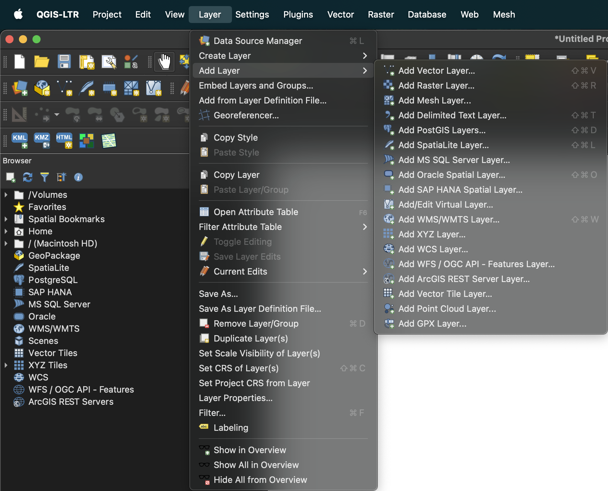
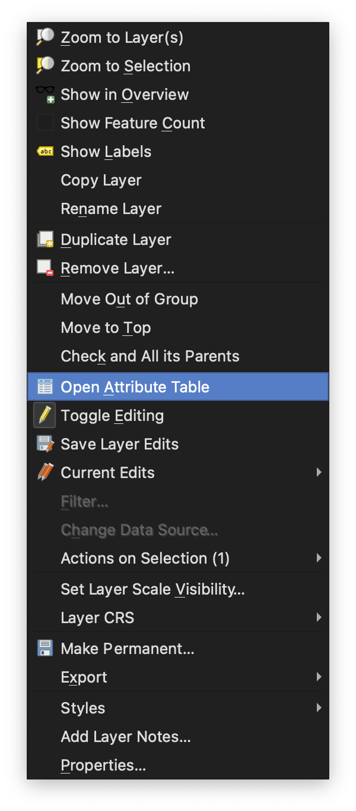
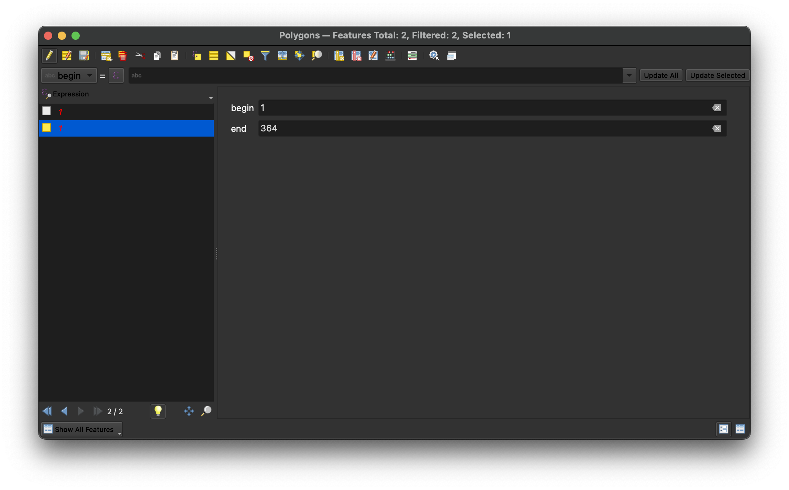

# AmeliaSWIM

This repository contains the code used in this paper to generate scenes for trajectory forecasting.

***Amelia: A Large Dataset and Model for Airport Surface Movement Forecasting [[paper](https://arxiv.org/pdf/2407.21185)]***

[Ingrid Navarro](https://navars.xyz) *, [Pablo Ortega-Kral](https://paok-2001.github.io) *, [Jay Patrikar](https://www.jaypatrikar.me) *, Haichuan Wang,
Zelin Ye, Jong Hoon Park, [Jean Oh](https://cmubig.github.io/team/jean_oh/) and [Sebastian Scherer](https://theairlab.org/team/sebastian/)

*Equal contribution

## Overview

**AmeliaSWIM**: Tool that contains the raw dataset download scripts as well as scripts to preprocess and filter the data.

[Amelia-48](https://ameliacmu.github.io/amelia-dataset/) dataset contains the trajectory as well map data. More information is available on the dataset [website](https://ameliacmu.github.io/amelia-dataset/).

## Pre-requisites

### Installation

Make sure that you have [conda](https://conda.io/projects/conda/en/latest/user-guide/install/index.html) installed.

**Recommended:** Use the  [`install.sh`](https://github.com/AmeliaCMU/AmeliaScenes/blob/main/install.sh) to download and install the Amelia Framework:

```bash
chmod +x install.sh
./install.sh amelia
```

This will create a conda environment named `amelia` and install all dependencies.

Alternatively, refer to [`INSTALL.md`](https://github.com/AmeliaCMU/AmeliaScenes/blob/main/INSTALL.md) for manual installation.

**Note:** AmeliaSWIM only requires the itself to run, only refer to AmeliaSWIM installation.

## Processed Data for 10 airports

Processed data (trajectory+map) for 10 airports [list](https://ameliacmu.github.io/amelia-dataset/) can be found at [dataset](https://airlab-share-01.andrew.cmu.edu:9000/amelia-processed/amelia-10.zip)

## Raw Data for any of the 48 airports

To download and convert trajectory data for any of the 48 airports in the [Data Tracker](https://ameliacmu.github.io/amelia-dataset/) for any time after Dec 1 2022, use the following steps

## How to use

Activate your amelia environment (**Please follow the installation instructions above**):

```bash
conda activate amelia
```

### Download raw files

The raw SWIM SMES `.njson.gz` files can be downloaded using the following scripts:

```bash
python download_raw.py --endpoint <minio-endpoint> \
                       --bucket <bucket-name> \
                       --start_time <start-time> \
                       --end_time <end-time> \
                       --destination <destination>
```

Where:

- `<minio-endpoint>`: MinIO server endpoint. By default, this is set to `airlab-share-01.andrew.cmu.edu:9000`.
- `<bucket-name>`: Name of the bucket to download files from. By default, this is set to `ameliaswim`.
- `<start-time>`: The start time in the format `YYYY-MM-DD HH:MM:SS`. By default it is set to `2023-01-01 00:00:00`.
- `<end_time>`: The end time in the format `YYYY-MM-DD HH:MM:SS`. By default it is set to `2023-01-02 00:00:00`.
- `<destination>`: Local directory to save the downloaded files. By default it is set to `swim_data/`.

### Process Data

```bash
python process.py data=<insert_month> airports=<airport_ICAO>
```

Where:

- `<insert_month>`: The month for which you want to process the data. The available months are `jan`, `feb`, `mar`, `apr`, `may`, `jun`, `jul`, `aug`, `sep`, `oct`, `nov`, `dec`, `base`, `default`.
- `<airport_ICAO>`: The ICAO code of the airport for which you want to process the data. The available airports are `katl`, `kaus`, `kbdl`, `kbfi`, `kbna`, `kbos`, `kbwi`, `kcle`, `kclt`, `kcvg`, `kdab`, `kdal`, `kdca`, `kden`, `kdfw`, `kdtw`, `kewr`, `kfll`, `khou`, `khwd`, `kiad`, `kiah`, `kjfk`, `klas`, `klax`, `klga`, `kmci`, `kmco`, `kmdw`, `kmem`, `kmia`, `kmke`, `kmsp`, `kmsy`, `koak`, `kord`, `korl`, `kpdx`, `kphl`, `kphx`, `kpit`, `kpvd`, `kpwk`, `ksan`, `ksdf`, `ksea`, `ksfo`, `ksjc`, `kslc`, `ksna`, `kstl`, `kteb`, `panc`, `phnl`.

#### Other Options

In `conf/data/base` the following options exist:

- `datapath`: Base Path for Raw Data
- `outpath`: Base Path for Processed Data
- `window`: Time (in sec) Duration for each CSV
- `n_jobs`: Num CPUs to use
- `parallel`: Use parallel processing
- `download`: Download the Raw Data (set to false if you already have the raw data)
- `overwrite`: Overwrite the processed data if it is found
- `start_time`: utc linux start time
- `end_datetime`: utc linux end time

In `conf/airports/<airport ICAO>` the following options exist:

- `airport`: Name of the airport
- `ref_lat`: Ref latitude to calculate  x,y cartesian
- `ref_lon`: Ref longitude to calculate  x,y cartesian
- `max_alt`: Max agent altitude to filter
- `fence`: Geo-fence to filter data

#### Example

If you would like to process the data for KLAX for Mar 2023 overwriting the existing and not downloading data a you can run the following command:

```bash
python python process.py data=mar airports=klax data.overwrite=True data.download=False
```

## Modify / Create Polygons

In order to modify or create new polygons, we used the [QGIS](https://qgis.org/en/site/) software.

<div align="center">
  
  <h5>QGIS Software Logo.</h5>
</div>

### Loading CSV file and creating polygons

1. Open QGIS
2. Click on `Layer` -> `Add Layer` -> `Add Delimited Text Layer`
3. Select the Layer
4. In Processing Toolbox search for Points to Path
5. In Processing Toolbox search for Lines to Polygons

<div align="center">
  
  <h5>QGIS Add Layer</h5>
</div>

### Modify Polygons

1. Select the layer
2. Click on `Toggle Editing` (yellow pencil)
3. Click on the `Split Parts` or `Split Features` tool
4. Create lines to split the polygon using right click and left click

<div align="center">
  
  <h5>QGIS Tools</h5>
</div>

### Export Polygon's coordinates

1. Right click on the layer
2. Click on `Open Attribute Table`
3. Select the Polygon you want to export (it will be highlighted in yellow)
4. Click on copy

<div align="center">
  
  
  <h5>QGIS Coordinates</h5>
</div>

Once copied it can be pasted in a notepad to create a csv file

<hr>

## BibTeX

If you find our work useful in your research, please cite us!

```bibtex
@inbook{navarro2024amelia,
  author = {Ingrid Navarro and Pablo Ortega and Jay Patrikar and Haichuan Wang and Zelin Ye and Jong Hoon Park and Jean Oh and Sebastian Scherer},
  title = {AmeliaTF: A Large Model and Dataset for Airport Surface Movement Forecasting},
  booktitle = {AIAA AVIATION FORUM AND ASCEND 2024},
  chapter = {},
  pages = {},
  doi = {10.2514/6.2024-4251},
  URL = {https://arc.aiaa.org/doi/abs/10.2514/6.2024-4251},
  eprint = {https://arc.aiaa.org/doi/pdf/10.2514/6.2024-4251},
}
```
